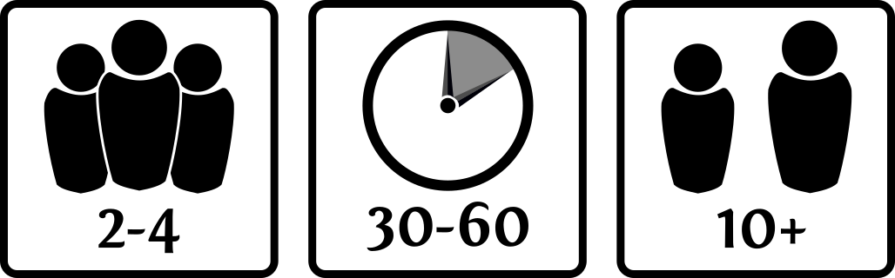

# Open Source Boardgame Icons

These are svg versions of the symbols created by [Sinister Design](https://sinisterdesign.net/open-source-board-game-box-art-icons/). They are still licensed under CC0, meaning anyone can use them free of charge for any purpose.

I created these since I couldn't find them all in a vector format, some had and some I recreated from the bitmaps. Hopefully these will be of use to more people!

The font used in the text is Fontin2 a free to use font. It can be found [here](https://www.exljbris.com/fontin.html).

## Preview

